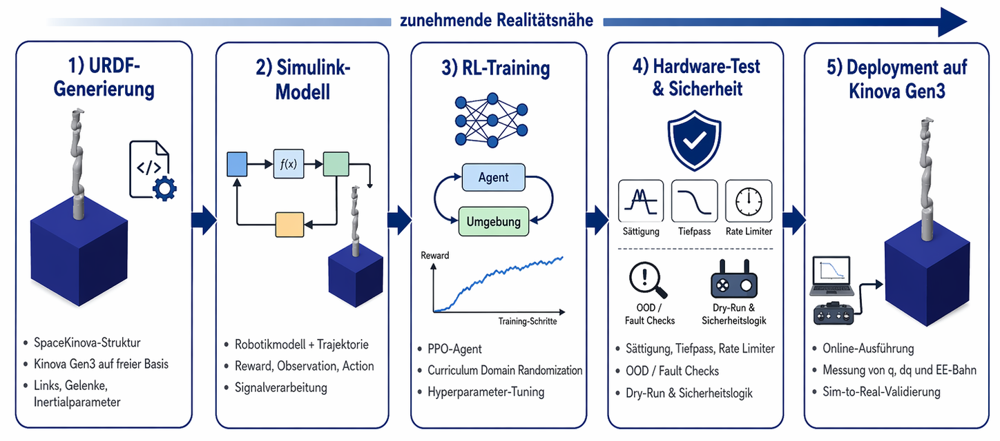
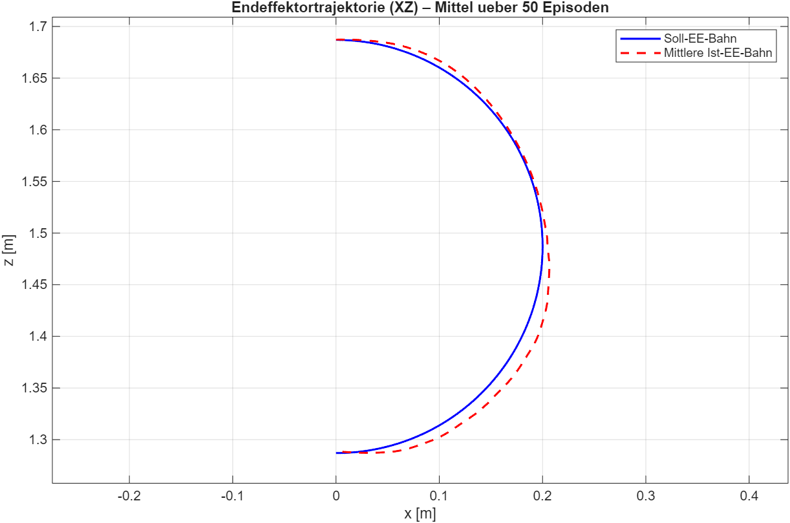
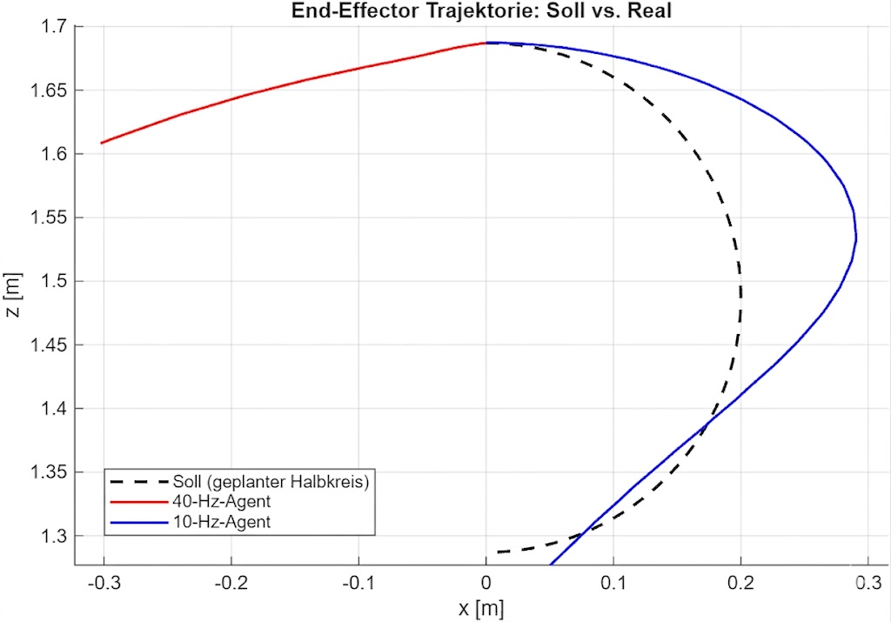

# Sim-to-Real Reinforcement Learning for SpaceKinova

This repository contains the MATLAB/Simulink implementation for a bachelor thesis on sim-to-real transfer of a reinforcement-learning-based Cartesian motion planner for a 7-DOF Kinova Gen3 manipulator mounted on a free-floating satellite-like base.

The project is simulation-first: the tracked repository already includes the SpaceKinova URDF, Simulink models, training/evaluation scripts, trained agents, deployment utilities, and figures needed to reproduce the core workflow without checking out external Kinova description packages.



## What This Project Does

The system models a Kinova Gen3 7-DOF arm on a free-floating cubic base and trains reinforcement learning policies for two task families:

- **Trajectory tracking** — following moving Cartesian end-effector references (e.g. circle, triangle).
- **Point-to-point reaching** — driving the end-effector from an arbitrary start configuration to a single static Cartesian target while keeping the free-floating base stable.

In both cases the simulation includes coupled base-arm dynamics, reference generation, action filtering, safety limits, and policy evaluation metrics.

The repository also contains the optional hardware-side tooling used to test and diagnose deployment on a real Kinova Gen3 through the MATLAB/Kinova MEX interface. Hardware execution is intentionally separated from the default simulation workflow.

## Key Contributions

- Extended a previous 4-DOF free-floating space robot setup to an industrial 7-DOF Kinova Gen3 model.
- Built and compared three Simulink model variants: torque input, motion-profile input, and a PD/velocity-control variant.
- Evaluated six continuous-control RL algorithms: PPO, TRPO, DDPG, TD3, SAC, and PG.
- Identified PPO as the strongest method for this setup in terms of tracking, base stability, and training robustness.
- Added Bayesian hyperparameter optimization for PPO.
- Implemented a Curriculum Domain Randomization framework for trajectory variation, mass/inertia uncertainty, actuator delay, and friction/damping perturbations.
- Added a **point-to-point reaching** variant that drives the end-effector to a static target from randomized start configurations, with joint-space target sampling (forward kinematics guarantees reachability), curriculum-based start/target randomization, and an early success-termination reward (distance, end-effector velocity, and base-orientation criteria all satisfied).
- Built a safety-focused hardware deployment layer with saturation, filtering, rate limiting, soft-limit braking, fault checks, out-of-distribution stopping, watchdogs, and dry-run/preflight gates.
- Diagnosed a practical sim-to-real bottleneck: the closed-loop MATLAB/MEX/Kortex deployment path reached only about 9.3 Hz, while the policy had been trained for a faster loop. This sample-rate mismatch is a central hardware result of the thesis.

## Repository Contents

| Path | Purpose |
|---|---|
| `SpaceKinova.urdf` | Combined robot description for the Kinova Gen3 on a free-floating cube base. |
| `SpaceKinovaDynamic.m` | Main PPO training script for the SpaceKinova simulation (trajectory tracking). |
| `SpaceKinova_CDR.m` | PPO training script with Curriculum Domain Randomization. |
| `SpaceKinova_point.m` | PPO training script for the point-to-point reaching task, with curriculum start/target randomization. |
| `calculate_kpi_spacekinova.m` | Evaluation script for running trajectory-tracking episodes and computing KPIs. |
| `calculate_kpi_spacekinova_point.m` | Evaluation script for the point-to-point reaching task (convergence, settling time, success rate, base disturbance). |
| `SpaceKinova_MotionProfile.slx` | Main motion-profile Simulink training model (trajectory tracking). |
| `SpaceKinova_MotionProfile_point.slx` | Motion-profile Simulink model for the point-to-point reaching task. |
| `SpaceKinova_MotionProfile_CDR.slx` | CDR-oriented Simulink model variant. |
| `SpaceKinova_Torque.slx` | Torque-input model variant used for algorithm comparison. |
| `SpaceKinova_PD-Control.slx` | PD/velocity-control model variant. |
| `SavedAgents/` | Selected trained agents used for evaluation and comparison. |
| `Deploy_Scripts/` | Optional hardware playback, timing diagnosis, and deployment scripts. |
| `Figures/` | Thesis and README figures for simulation, CDR, point-to-point, and hardware results. |

`ros_kortex/` is not part of this repository and is not required for the normal simulation or evaluation workflow. The included `SpaceKinova.urdf` is the tracked model used by the MATLAB scripts.

## Getting Started

### Requirements

Use MATLAB with the following products installed:

- Simulink
- Simscape and Simscape Multibody
- Robotics System Toolbox
- Reinforcement Learning Toolbox
- Parallel Computing Toolbox, optional but useful for training

For optional hardware experiments, you additionally need:

- A Kinova Gen3 7-DOF arm
- Robotics System Toolbox Support Package for KINOVA Gen3 Manipulators
- The Kinova/MATLAB MEX interface available on the MATLAB path
- A safe physical setup with emergency stop, clear workspace, and network access to the robot

### Basic Setup

Clone the repository and open MATLAB in the repository root:

```matlab
cd path/to/this/repository
addpath(genpath(pwd))
```

Open the main model if you want to inspect the environment:

```matlab
open_system("SpaceKinova_MotionProfile.slx")
```

The tracked `SpaceKinova.urdf` is used directly by the scripts. No external Kinova URDF checkout is needed for the included simulation workflow.

## Running Simulation Training

Run the baseline PPO training script (trajectory tracking):

```matlab
SpaceKinovaDynamic
```

This script prepares the reference trajectory, imports `SpaceKinova.urdf`, solves inverse kinematics for the trajectory seed, configures the RL observation/action spaces, and trains a PPO agent in `SpaceKinova_MotionProfile.slx`.

Run the Curriculum Domain Randomization training script:

```matlab
SpaceKinova_CDR
```

`SpaceKinova_CDR.m` includes switches for trajectory randomization, mass/inertia perturbation, actuator delay, friction/damping variation, and start-configuration randomization. Some CDR features require matching Simulink-side parameterization; keep feature flags disabled unless the corresponding model blocks are connected.

Run the point-to-point reaching training script:

```matlab
SpaceKinova_point
```

`SpaceKinova_point.m` trains a PPO agent in `SpaceKinova_MotionProfile_point.slx` to drive the end-effector to a static target. It imports the URDF, solves IK for the nominal target to obtain an anchor configuration, and applies a minimal curriculum that randomizes the start configuration (around a fixed anchor) and the target point. Target randomization is done in joint space and mapped to a Cartesian point via forward kinematics, so every sampled target is reachable by construction. The reward combines a distance gradient, a near-target braking term, base-stability penalties, and a terminal success bonus that ends the episode early once the end-effector is inside the tolerance at low velocity with a stable base.

The scripts currently keep the agent-save blocks commented out. The trained `agent` and `trainingStats` remain available in the MATLAB workspace after a run. Re-enable the save block in the script if you want to persist new training results.

## Evaluating Trained Agents

Selected trained agents are already committed under `SavedAgents/`. To run the trajectory-tracking KPI evaluation with the default configured agent:

```matlab
calculate_kpi_spacekinova
```

The evaluation script loads a trained agent, runs repeated Simulink episodes, and computes performance indicators for:

- end-effector tracking
- base disturbance
- energy/power use
- command smoothness
- return and early-termination behavior

By default, the script points to a committed agent file:

```matlab
SavedAgents/MotionProfile/Circle/PPO/ppo_10hz.mat
```

You can change `agentFile` inside `calculate_kpi_spacekinova.m` to evaluate another committed or newly trained `.mat` agent.

To evaluate the point-to-point reaching task:

```matlab
calculate_kpi_spacekinova_point
```

This script runs repeated reaching episodes in `SpaceKinova_MotionProfile_point.slx` and reports convergence-oriented KPIs: final and minimum distance to target, settling time, success rate against a configurable tolerance, path length and efficiency, overshoot, base disturbance, and effort/smoothness. As with the trajectory script, you can change the configured agent file inside the script.

## Running Simulation Training and Evaluation Notes

Both task families share the same robot model, observation conventions, and safety limits, which makes it possible to reuse most of the analysis tooling across trajectory tracking and point-to-point reaching. The key difference is the reference: a moving timeseries for tracking versus a constant target (with zero reference velocity) for reaching.

## Results

### PPO and Algorithm Comparison

The thesis compared PPO, TRPO, DDPG, TD3, SAC, and PG on the 7-DOF SpaceKinova setup. PPO gave the best overall balance of tracking accuracy, base stability, and training robustness. In the reported 50-episode evaluation, PPO reached:

- mean squared end-effector tracking error: `0.0015 m^2`
- maximum end-effector error: `0.1866 m`
- mean base-orientation error: `0.0169 rad`
- mean return: `638.8`
- early-termination rate: `0`

Bayesian hyperparameter optimization further improved PPO performance on the triangle trajectory, increasing the mean return from `224.6` with default PPO settings to `1244` for the optimized configuration.



### Point-to-Point Reaching

The point-to-point variant was evaluated as an out-of-distribution test: the arm was started at `[0 -90 0 0 0 0 0]` deg — a configuration outside the training start distribution — and commanded to `target_pos = [0.479, -0.005, 1.136]`. Over 5 episodes with a 50 mm success tolerance, the trained policy reached the target reliably and came to rest with a stable base:

- success rate: `100 %`
- mean final end-effector error: `35.2 mm`
- mean minimum distance to target: `27.2 mm`
- mean settling time: `27.64 s`
- max overshoot: `0.0 mm`
- mean path length: `2.790 m`
- mean path efficiency: `0.51` (1.0 = straight-line optimal)
- mean base-orientation error: `0.051 rad`
- mean base angular velocity: `0.002 rad/s`
- mean power: `0.16 W`

The convergence curve below shows the distance to the target over time, averaged across the five episodes, settling below the 50 mm tolerance band without overshoot. The result indicates that the policy generalizes to an unseen start configuration while keeping base disturbance low; the moderate path efficiency (`0.51`) shows the approach path is not yet direct and leaves room for shaping improvements.


### Curriculum Domain Randomization

The CDR framework gradually increases simulation diversity over four curriculum phases. It was designed to improve robustness against trajectory changes, mass/inertia uncertainty, actuator delay, and friction/damping variation.


The main finding is that CDR is most valuable when the test disturbance differs meaningfully from the nominal training case. For example, trajectory randomization improved generalization to an unseen mirrored half-circle, while mass randomization produced consistent robustness gains under strong base-mass perturbation.

### Hardware Diagnosis

The hardware tests validated that the Kinova Gen3 can follow sent joint-velocity commands with high joint-space accuracy in open-loop experiments. The limiting issue appeared in closed-loop deployment: the full MATLAB/MEX loop with command sending, feedback reading, policy inference, filtering, and logging ran at about `9.3 Hz`, far below the intended training loop rate.



This means the observed closed-loop hardware behavior cannot be used as a clean verdict on the policy's real-world generalization. The implementation-level sample-rate mismatch itself is an important practical result: future deployment should either train for the achievable loop rate or move to a lower-latency control interface.

## Limitations

- The repository is centered on MATLAB/Simulink and requires the listed toolboxes.
- Some scripts contain experiment-specific constants, selected agent paths, and commented save blocks that may need adjustment for new experiments.
- Full hardware deployment is not plug-and-play from a fresh clone; it depends on a Kinova Gen3 setup and the external Kinova MEX interface.
- The closed-loop real-hardware policy evaluation remains limited by the measured MATLAB/MEX/Kortex timing bottleneck.
- The point-to-point evaluation reported here covers a single nominal target with a small episode count; broader target coverage and larger sample sizes would strengthen the reaching results.
- Generated logs, local hardware runs, and external Kinova support files are intentionally not part of the tracked repository.

## Citation / Thesis Context

This repository accompanies the bachelor thesis:

> Steven Patrick Ermisch, "Sim-to-Real-Uebertragung einer Reinforcement Learning getriebenen kartesischen Bewegungsplanung eines 7 DoF frei-schwebenden Weltraumroboters", Bachelor thesis, Frankfurt University of Applied Sciences, submitted May 1, 2026.

BibTeX:

```bibtex
@thesis{ermisch2026spacekinova,
  author = {Ermisch, Steven Patrick},
  title = {Sim-to-Real-Uebertragung einer Reinforcement Learning getriebenen kartesischen Bewegungsplanung eines 7 DoF frei-schwebenden Weltraumroboters},
  school = {Frankfurt University of Applied Sciences},
  type = {Bachelor thesis},
  year = {2026}
}
```